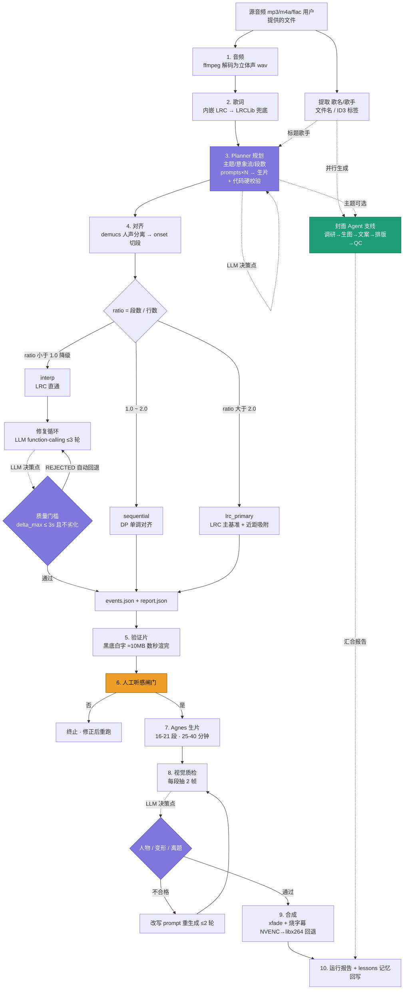
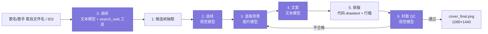

# Lyric Video Agent

**输入一首歌，输出一条可发布的抖音歌词视频：正片（歌词对轴 + AI 风景 + 视觉自检）+ 竖版封面（歌曲调研 + AI 背景 + AI 文案 + 行楷排版）。**


从 25 首实际交付的抖音歌词视频生产流水线提炼而来：底层工具全部经过真实交付验证，
LLM 只在固定决策点出场，并补上了原人工流程里最大的断点——画面质检。

---

## 1. 整体架构

流水线共 11 级，每级幂等（产物已存在即跳过，天然支持断点续跑）。



紫色 = LLM 决策点，橙色 = 人工闸门，绿色 = 独立 Agent。LLM 决策点共 8 处：
主链路 3 个（Planner 规划 / 修复循环 / 视觉质检）+ 封面 Agent 内部 5 处（调研 / 选帧 / 背景 / 文案 / QC）；
除这些决策点外，其余全是确定性代码。

**封面 Agent 内部流水线**（详见 §4）：



---

## 2. 为什么是 Agent，而不是"调了 LLM 的脚本"

三个特征缺一不可，缺任何一个都只是工具：

| 特征 | 本项目体现 |
|---|---|
| **决策点** | LLM 在 8 处需要判断力的位置出场（主链 3：Planner、修复循环、视觉质检；封面 5：调研、选帧、背景、文案、QC）；规则写得完的用代码（段数按覆盖公式算、人物词用正则净化） |
| **工具调用** | 修复循环里 LLM 通过 function calling 在 `re_align` / `set_trim` / `accept` 中自主选择，读观察再决策 |
| **反馈闭环** | 质量门槛自动拒绝劣化候选并回退；每次运行沉淀 lessons，下次规划注入 |

### 关于"为什么不用 LLM 自由循环"

| 维度 | LLM 自由循环 | 本项目的混合式 |
|---|---|---|
| 成本 | 每步过 LLM，一首歌上百次调用 | 一首歌约 5~15 次（规划 1 + 修复 ≤3 + 质检 ≤2 + 封面 ≤5） |
| 确定性 | 字幕时间轴不该有随机性 | 对齐/合成是纯函数，可回归测试 |
| 可调试 | 失败要翻对话日志 | 每级落盘产物，单级可重跑 |

原则：**能用代码确定性解决的不用 LLM，LLM 出场的地方必须是真正需要判断力的。**

---

## 3. 核心技术：字幕-人声对齐

### 3.1 问题

验收标准只有一句：**唱一句出一句、唱完即清**。LRC 标注的是歌词本时间，与真实
人声常有 0.3~5s 偏差，且**非线性**（不同段落偏差不同）。

### 3.2 方案演进（每版都是一次失败分析）

| 版本 | 方案 | 结果 |
|---|---|---|
| v1-v3 | librosa 全曲能量 / onset 检测 | 伴奏鼓点假峰、短间奏误判（+5~7s） |
| v4 | demucs + 人工逐行 LINE_SEG 映射 | 质量完美但不可扩展（每首半小时人工） |
| v5-v6 | LRC 时刻就近匹配段 | **失败**：时刻落在句间静音致认错段，数量不对等时逐级漂移 |
| — | 均匀量化（行 i 认领第 i·m/n 块段） | **失败**：副歌长句跨 4 段，从第 2 行起错位 12s+ |
| **最终** | **DP 单调对齐** | 见下 |

### 3.3 DP 单调对齐

把"行→段"映射建成带约束的最优对齐问题：

- **状态**：`dp[i][j]` = 前 i 行消费前 j 段的最小代价
- **代价**（双向锚定）：`|segs[j].起点 − LRC_i| + |segs[k−1].末点 − LRC_{i+1}|`
- **跳过噪声段**：固定罚金 `SKIP = 8s`（高于正常误差、低于错配代价）
- **单调性**：由状态转移天然保证，起点永不回漂

回归结果：

| 歌曲 | 基准 | 起点偏差中位数 |
|---|---|---|
| 寂寞沙洲冷 | 人工逐行校验的地面真值 | **0.00s** |
| 樱花草 | 用户验收过的生产版 events | **0.03s** |
| 对照组：均匀量化 | 寂寞沙洲冷同份数据 | 12.44s |

### 3.4 三路路由

`ratio = 演唱段数 / 歌词行数` 决定路线，不同歌的病理不同：

| 情形 | 路由 | 理由 |
|---|---|---|
| 1.0 ≤ ratio ≤ 2.0 | `sequential`（DP） | 段数≈行数，onset 是可靠骨架 |
| ratio > 2.0 | `lrc_primary` | 段远多于行（DJ 版/重复副歌），就近吸附会跨副歌 |
| `ratio < 1.0` | `interp` | 段少于行（连唱/合句），LRC 打底 |

`lrc_primary` 的 ±1.2s 吸附窗口来自实战：窗口放大后贪心会把重复副歌的行吸到
上一轮副歌的 onset，再被单调链放大成 3~9s 暴偏。

### 3.5 事件化规则

- `end = 下一句起点`（零空隙零重叠）
- 长间奏（句距 > 10s）：`end = start + 6s` 驻留即清
- **末句 `end = start + 6s`**，绝不挂片尾（曾因尾奏 20s 挂死同一句返工）
- 渲染只用 `\fad(150,180) + \be1`，**禁止 `\t` 动画**——动画会拉偏感知的出字边界

---

## 4. 修复循环：function-calling 自修复

**触发**：对齐走降级路由 `interp` 时。

**流程**：LLM 读对齐报告 → function calling 选择工具（`re_align` 调分段灵敏度 /
`set_trim` 裁前奏）→ 读执行观察 → 决定下一步或 `accept`。编排器执行工具并回填
观察，轮数上限 3。

**质量门槛**（关键教训）：把 `merge_gap` 从 0.30 调到 0.22 能让《梦的光点》从
interp 升级到 sequential（56→64 段），但 `delta_max` 从 2.5s **拉爆到 15.1s**——
**路由升级 ≠ 质量提升**。所以候选必须通过 `delta_abs_max ≤ 3.0` 且不劣化才被采纳，
否则 REJECTED、自动回退，并把拒绝原因回传给 LLM（提示不要原样重试）。

### 真模型实测（`agnes-2.5-flash`，真实歌曲《梦的光点》62 行 / 56 段）

复现脚本：`tests/probe_repair_realmodel.py`（无 key 或缺失数据时自动 SKIP）。

**运行 A**：

```
r1: re_align {'merge_gap': 0.22} -> sequential dmean=2.255 dmax=15.138
      REJECTED: delta_abs_max=15.138s 超过门槛 3.0s
r2: set_trim {'seconds': 18}      -> interp dmean=0.561 dmax=2.498
      REJECTED: 整体质量未优于当前结果
r3: re_align {'merge_gap': 0.28, 'thr_low': 0.45} -> interp dmean=0.561
      REJECTED: 整体质量未优于当前结果
r3: accept                        -> 达到轮数上限，自动接受
最终 route=interp delta_mean=0.561s
```

**运行 B**（同输入，LLM 采样随机性）：

```
r1: set_trim {'seconds': 20} -> interp dmean=0.561 dmax=2.498   REJECTED: 未优于当前
r2: set_trim {'seconds': 22} -> interp dmean=0.561 dmax=2.498   REJECTED: 未优于当前
r3: set_trim {'seconds': 18} -> interp dmean=0.561 dmax=2.498   REJECTED: 未优于当前
r3: accept                                                       轮数上限
最终 route=interp delta_mean=0.561s
```

**两次运行读出的三件事**：

1. **门槛真的在兜底**：A 的 r1 复现了历史事故——`merge_gap=0.22` 把路由升级成
   sequential，同时把 `delta_max` 从 2.5s 拉爆到 15.1s，被 `≤3s` 门槛拦截并回退。
2. **LLM 决策有随机性，所以门槛不可省**：同样输入，A 走了
   `re_align → set_trim → re_align`，B 走了三次 `set_trim`。若没有质量门槛，
   两次运行会产出质量差异巨大的结果。
3. **暴露了一个真实失效模式——参数抖动**：B 连续三次微调 `set_trim`（20→22→18），
   产出指标**完全相同**。根因是 `set_trim` 裁的是前奏，而病根是"段数 56 < 行数 62"，
   工具不对症；同时门槛的拒绝反馈只说"未优于当前"，没提示换工具，模型只能盲目抖动。

第 3 条是这个项目最值得讲的工程发现：**Agent 的失败往往不是模型不聪明，而是
工具语义与反馈粒度不匹配**。改进方向已在计划中（拒绝原因附带"换工具"建议、
检测连续同类型动作后强制收敛）。

这个环节也回答了"为什么不写死修复策略"：什么参数值得试依赖歌曲形态（段/行比、
前奏长度），正是 LLM 判断力性价比最高的地方；而门槛保证它判断错了也不会变差。

---

## 5. 视觉质检：补上人工流程的断点

过去 25 首歌靠人眼逐段终审，因为 AI 视频的人物变形无法自动判定。本项目用视觉
模型自动化：每段抽 2 帧（5s/11s，避开转场）→ 按人物/变形/离题三项输出结构化结论
→ 不合格段用模型给出的 `revised_prompt` 重生成（≤2 轮，防费用失控）。

无视觉模型时降级为"提示人工终审"，不阻塞流程。

---

## 6. 封面 Agent：为什么是两个 Agent

### 6.1 三条立论

- **模态不同**：视频 Agent 驱动视频模型；封面 Agent 协同图片 + 文本 + 视觉模型，
  工具箱与失效模式完全不同。
- **QC 闭环不同**：正片查人物/变形/离题；封面查文字可读性/竖版构图/截断，
  修复动作也不同（重生成背景 vs 改写 prompt）。
- **生命周期不同**：封面 Agent 是消费上游产物的独立服务，不是流水线的一个阶段——
  它在 **规划完成后立即并行启动**（不等待生片/合成），主链路只依赖歌名/歌手与
  plan 主题，背景 prompt 来自调研产出而非视频帧。因此 `--skip-generate`（无正片）
  也能出封面，封面还能对任意已有视频独立补跑。**此立论已在代码层面兑现**
  （`orchestrator._stage_cover_start` 在 Stage 3 后即拉起线程，与对齐/生片/合成
  重叠执行，`_stage_cover_join` 在报告前汇合；支线失败自动回退串行帧降级路径）。

协同方式：通过文件系统交换结构化决策（`cover_decision.json` 记录每步模式与理由），
无中心对话。

### 6.2 先调研，再动笔

把歌名/歌手交给文本模型，配 `search_web` 工具（ddgs 直连）+ 预取的 MusicBrainz
元数据。模型自主决定搜什么（实测搜 1~4 轮）→ 综合出 {背景, 视觉概念, 英文生图
提示词, 文案启发}。

真实案例（《梦的光点》）：搜出"动画《神兵小将》主题曲、林俊杰作曲"后，视觉概念
从"向日葵花田"（猜歌词）升级为"晨曦穿透云层，微弱光点汇聚成希望的脉络"（懂这首歌）；
文案随之从"逆着光 也要开成向日葵"变为更贴题的"追着那束光出发"。


### 6.3 设计判断：模型负责画面，代码负责文字

图像模型画中文几乎必乱码，所以排版用代码 `drawtext` + 华文行楷实现。

---

## 7. 成本与可靠性工程

生片是最贵环节（16-21 段 × 25-40 分钟），三层防线：

**人工闸门**卡在昂贵环节之前——验证片 10MB 数秒渲完可无限重渲，生片 200-330MB
半小时起。字幕错了重渲验证片只要几秒，风景错了要重花钱。

**幂等续传**：每级产物落盘，重跑自动跳过。后台进程被系统回收（实测约 50 分钟
周期）后重跑命令即可，已生成片段不重复计费。

**故障矩阵**（`videogen.py`，全部来自真实事故）：

| 故障 | 现象 | 对策 |
|---|---|---|
| 提交限流 | 429 queue.full | POST 也退避 65s 重试 |
| 轮询抖动 | SSL EOF / 503 | try/except + 退避，不快速重试 |
| 下载中断 | ChunkedEncodingError | Range 断点续传 + 重试 |
| 假完成 | 下载完不是 mp4 | ftyp 头校验 + 大小下限校验 |
| 内容策略 | 400 | 换中性表述（400 不退避） |
| NVENC 失败 | 驱动/显存 | 自动回退 libx264 |

---

## 8. 记忆设计

| 类型 | 生命周期 | 用途 |
|---|---|---|
| `policy/playbook.md` | 长期、人工维护 | 领域 SOP（限流参数、字幕禁令、路由选择），规划时整篇注入 |
| `memory/lessons.jsonl` | 短期、自动追加 | 每次运行记录路由/质量/QC 结果，下次取最近 5 条注入 |

区分理由：策略编码的是"这个领域的物理规律"，不该让模型每次重学；经验是"上一首
哪类 prompt 触发了内容策略"这类近期事实，策略手册里不会有。

---

## 9. 快速开始

```bash
# 1. 环境（建议复用已有 torch 以省几 GB）
python -m venv --system-site-packages .venv
.venv/Scripts/pip install -r requirements.txt -r requirements-demucs.txt

# 2. 配置 LLM（任何 OpenAI 兼容端点：DeepSeek / GLM / Qwen / Agnes / OpenAI...）
copy config.example.json config.json   # 或设环境变量 LVA_LLM_API_KEY

# 3. 先离线走一遍（MockLLM，不花钱，约 25s）
.venv/Scripts/python -m agent.cli "梦的光点" --audio "C:/path/梦的光点 - 王心凌.mp3" --mock --yes --skip-generate

# 4. 正式运行（人工听感闸门在验证片之后，确认对齐才开始生片）
.venv/Scripts/python -m agent.cli "梦的光点" --audio "C:/path/梦的光点 - 王心凌.mp3"
```

### 常用参数

| 参数 | 作用 |
|---|---|
| `--mock` | 离线假 LLM，不花钱验证链路 |
| `--yes` | 跳过 Stage 6 人工听感闸门 |
| `--skip-generate` | 跳过生片（只出验证片 / 用已有 clips 合成） |
| `--skip-qc` / `--skip-repair` / `--skip-cover` | 跳过对应环节 |
| `--trim 50` | 裁掉 50s 前奏 |
| `--artist NAME` | 提高 LRCLib 命中率 |

---

## 10. 降级矩阵

每个环节都能独立降级，不阻塞全流程：

| 缺失配置 | 行为 |
|---|---|
| 无 LLM key | 自动 mock：规划用默认策略，全链路照常可跑 |
| 无视觉模型 | 跳过自动质检，提示人工终审 |
| 无 demucs | 对齐降级全曲包络，报告标注质量下降 |
| 无 Agnes key | 只产出验证片，生片环节跳过 |
| 无网络/搜索失败 | 封面调研步跳过，退回 plan 主题 |
| NVENC 不可用 | 自动回退 libx264 |

---

## 11. 产物

一次运行会在 `runs/<歌名>/` 下得到：

| 文件 | 说明 |
|---|---|
| `plan.json` | Agent 制作计划（主题/意象流/字体/段数） |
| `events.json` + `report.json` | 逐句字幕时间轴 + 对齐质量报告（含修复决策历史） |
| `<歌名>_字幕验证版.mp4` | 黑底白字验证片（人工听感闸门） |
| `clips/clip01..N.mp4` | AI 生成的风景片段 |
| `<歌名>_歌词视频.mp4` | 正式成片（1080p，烧录字幕 + 原曲立体声） |
| `cover_final.png` | 封面（1080×1440 竖版，可直接发布） |
| `cover_decision.json` | 封面每步决策记录 |
| `run_report.json` | 本次运行完整报告 |

---

## 12. 目录结构

```
agent/                 # Agent 层
  cli.py               #   命令行入口
  orchestrator.py      #   11 级流水线编排（幂等，可断点续跑）
  planner.py           #   [决策点] 制作规划（LLM 生成 + 确定性校验）
  repair.py            #   [决策点] function-calling 修复循环 + 质量门槛
  verifier.py          #   [决策点] 视觉质检 + 重生成循环
  cover.py             #   [决策点] 封面 Agent（调研/选帧/背景/文案/排版/QC）
  llm.py               #   OpenAI 兼容客户端 + MockLLM（离线测试）
  memory.py            #   playbook（长期策略）+ lessons（运行经验）
tools/                 # 工具层（纯确定性函数，可独立单测）
  lyrics.py            #   内嵌 LRC / LRCLib / 繁简转换 / 脏数据过滤
  audio.py             #   ffmpeg / demucs 封装 / RMS 包络
  research.py          #   歌曲调研（ddgs 搜索 + MusicBrainz + 本地元数据）
  align.py             #   字幕-人声对齐（三路路由 + DP 单调对齐）
  ass.py               #   ASS 字幕渲染（fad-only 极简策略）
  videogen.py          #   Agnes 视频 API（限流/续传/校验全封装）
  imagogen.py          #   Agnes 图片 API + 竖版裁切
  typography.py        #   封面排版（drawtext + 中文字体）
  compose.py           #   xfade 合成 + NVENC（失败回退 libx264）
  inspect.py           #   ffprobe / 抽帧
  schemas.py           #   function calling 工具 Schema
policy/playbook.md     # 领域 SOP（规划时整篇注入）
memory/lessons.jsonl   # 运行经验（自动沉淀）
tests/
  test_*.py            #   回归门禁（MockLLM，离线确定性，进 CI）
  probe_*.py           #   真模型探针（需 key，手动跑，不进 CI）
docs/
  pipeline_main.png    #   主流程图（README mermaid 的 PNG 附图）
  pipeline_cover.png   #   封面 Agent 子图
  cover_example.png    #   真模型产出的封面成品示例
  evidence/            #   真模型实测轨迹（修复循环决策序列 / 封面决策链）
  概念解释.md          #   术语与流程的通俗解释
tools/render_flow.py   # 流程图出图脚本（Pillow 离线兜底）
```

## 13. 测试

**回归门禁**（MockLLM，离线确定性，每次改动必跑）：

```bash
.venv/Scripts/python tests/test_lyrics.py        # 内嵌LRC/LRCLib/过滤（真实 mp3）
.venv/Scripts/python tests/test_align.py         # 对齐回归（寂寞沙洲冷地面真值）
.venv/Scripts/python tests/test_orchestrator.py  # ASS/规划/修复循环/NVENC 合成
.venv/Scripts/python tests/test_cover.py         # 封面 Agent 离线全链
```

**真模型探针**（需 key，手动执行，不进 CI，理由见 §14）：

```bash
.venv/Scripts/python tests/probe_repair_realmodel.py  # 修复循环真模型决策轨迹
.venv/Scripts/python tests/probe_cover_headless.py    # 无正片出封面（真生图）
```

数据依赖型测试使用已交付歌曲的本机文件，缺失时自动 SKIP——CI 上跑纯离线部分。
测试刻意保持"零依赖独立脚本"形态而非 pytest 参数化：CI 免装额外框架，每个脚本
可单独运行。

本地自检：

```bash
.venv/Scripts/python -m ruff check .
.venv/Scripts/python -m ruff format .
```

## 14. 实测状态与已知边界

### 零成本：全栈跑在 Agnes 免费模型上

文本 / 视觉用 `agnes-2.5-flash`，图像用 `agnes-image-2.1-flash`，视频用
`agnes-video-v2.0`——**整条链路不花一分钱**，换厂商只需替换 `config.json` 与两个
客户端文件（`videogen.py` / `imagogen.py`）。

### 实测覆盖

| 环节 | 状态 | 证据 |
|---|---|---|
| 修复循环 | **真模型实测 2 次** | [`docs/evidence/repair_real_trajectory.json`](docs/evidence/repair_real_trajectory.json)，轨迹见 §4 |
| Planner 规划 | **真模型实测** | 《人间烟火》真跑，产出主题 + 16 段意象流 + 16 条 prompt |
| 封面链路（调研/选帧/生图/文案/QC） | **真模型实测** | [`docs/evidence/cover_decision.json`](docs/evidence/cover_decision.json)、`docs/cover_example.png` |
| 封面并行支线（无正片也能出封面） | **代码兑现 + 真模型验证** | `orchestrator._stage_cover_start/join` 并行编排；`tests/probe_cover_headless.py` 真跑 |
| LRCLib 歌词兜底 | **真跑** | 《人间烟火》无内嵌歌词 → LRCLib 命中 22 句 |
| 视觉 QC | 代码路径就绪，待生片后验证 | `agent/verifier.py` |

复现真模型修复轨迹：`tests/probe_repair_realmodel.py`（无 key / 缺数据时自动 SKIP）。
复现封面「无正片出封面」真模型轨迹：`tests/probe_cover_headless.py`（无 Agnes 图片 key 时自动 SKIP）。

### 测试分层：为什么 CI 跑 Mock、真模型走探针

本项目刻意把测试分成两层，边界写在这里以免误读上表的"真模型实测"：

| 层 | 脚本 | 用什么模型 | 进 CI | 目的 |
|---|---|---|---|---|
| **回归门禁** | `tests/test_*.py`（4 个） | `MockLLM` / `MockImageGen` | ✅ 每次改动必跑 | 确定性、零成本、零网络：验证编排逻辑、校验规则、质量门槛、降级分支 |
| **真模型探针** | `tests/probe_*.py`（2 个） | Agnes 真端点 | ❌ 手动执行 | 验证真实模型的决策行为（工具选择、vision 判断、生图质量），轨迹落盘留证 |

**为什么真模型不进 CI**——两条硬理由，不是偷懒：

1. **密钥不进仓库**：`config.json` 在 `.gitignore` 里，CI 环境没有 key，真模型调用必然失败或需要在 CI 里注入密钥（增加泄露面）。
2. **真模型不确定性会污染门禁**：同一输入两次调用可能选不同工具、给不同文案，断言无法稳定；网络抖动/限流会让测试红得毫无信息量。门禁要的是"我改的代码有没有坏"，不是"今天模型心情如何"。

所以真模型的验证方式是**手动跑探针 + 轨迹落盘**：每次真跑的决策序列写进 JSON（如上表证据文件），出了问题可回溯，成功的样本进 README 当实测依据。这也是为什么 §4 的失效模式（参数抖动）是从**真实轨迹**里读出来的，而不是猜的。

> 一句话概括对外说法：**代码全链路支持真模型，关键环节已本地真跑并留有轨迹；CI 用 Mock 做确定性回归，避免密钥入库与模型抖动污染门禁。**

### 已知边界

- 修复循环暴露**参数抖动**失效模式（§4 运行 B）：拒绝反馈未提示"换工具"，
  模型会连续微调同一工具。已定位，改进在计划中。
- 帧降级封面（无图片模型 key）若源视频带烧录字幕，选中帧会含字幕文字，需人工终审。
- 对齐质量依赖 demucs 分离质量；强混响/现场版人声可能切碎，需人工锚点兜底。
- `interp` 路由未实现人工锚点插值 UI；修复循环目前只在 interp 路由触发。
- 视觉 QC 对"轻微变形"召回率有限，人工终审仍是建议步骤。
- Agnes API 是本项目特定的生成端点；换厂商只需替换 `videogen.py` 与 `imagogen.py`。

## 15. 设计文档

[ARCHITECTURE.md](ARCHITECTURE.md) 覆盖：为什么不用 LLM 自由循环、规划器生成-校验
闭环、DP 对齐算法与三路路由、修复循环与质量门槛、视觉质检、双 Agent 协同、
成本与可靠性工程、记忆设计。
